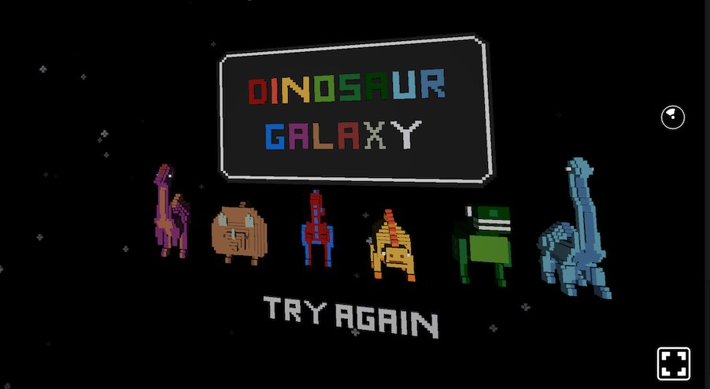

### React VR Tutorials

### [Getting started with React VR](https://www.pluralsight.com/guides/front-end-javascript/getting-started-with-react-vr)
*By Esteban Herrera, April 26, 2017*

A thorough intro covering the topics Requirements,
Creating the project, React VR, Pano images, 3D models, Animating the models, and Styling and Buttons.

#### [How To Make React VR Apps](https://dzone.com/articles/how-to-make-react-vr-apps)
*by Alexander Sokhanych, May 01, 2017*

Setup, navigation between scenes, some UI animation.

#### [How I got a React VR dev environment working with an Android Cardboard HMD](https://hackernoon.com/how-i-got-a-react-vr-dev-environment-working-with-an-android-cardboard-1fcaf00faebc)
*By Brandon Bakker, Apr 22, 2017*

### React VR Postmortems

#### [Mint: Building (Dinosaur Galaxy) in React VR: What we learned](https://medium.com/mint-digital/building-in-react-vr-what-we-learned-779a76dde74c)

*[Edit](https://github.com/ahcox/ahcox.com/edit/master/reactvr/resources.md) [this page](http://ahcox.com/reactvr/)*.
